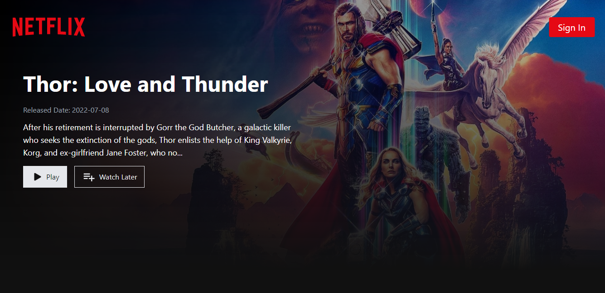
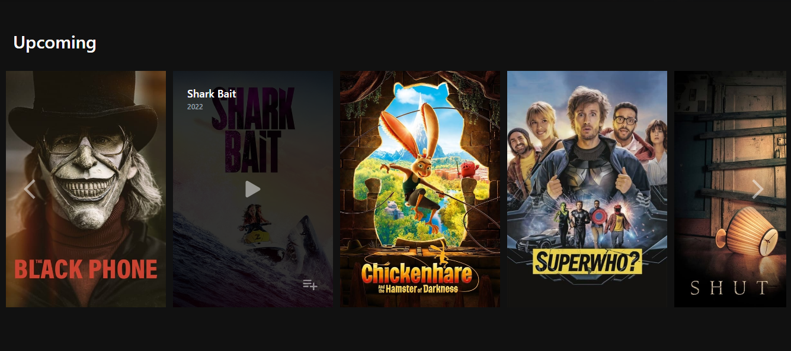

## Table of Contents
1. [General Info](#general-info)
2. [Technologies](#technologies)
3. [Key Features](#key-features)

### General Info
***
This is a Solo Personal Project Netflix Clone App made using React , Tailwind CSS and Firebase.

[Live Link](https://netflix-clone-437df.web.app/)
### Screenshot

## Technologies
***
A list of technologies used within the project:
* [React Js](https://reactjs.org/): Version 18 
* [Tailwind CSS](https://tailwindcss.com/): Version 3.1.6
* [Firebase](https://firebase.google.com/): Version 9.9.1
## Key Features
***
1. Used [React Router](https://reactrouter.com/).

2. [TMDB API](https://www.themoviedb.org/) Intergration.
   i.Used API for the Movies data and also added trailer preview capability
3. Responsive design with [Tailwind CSS](https://tailwindcss.com/).
   i.Used utility first framework with mobile first design implementation
4. [Firebase](https://firebase.google.com/) Authentication and FireStore Database  Integration.
   i.Used Firebase for Authentication and FireStore as a database to store watchlist movies for specific account.